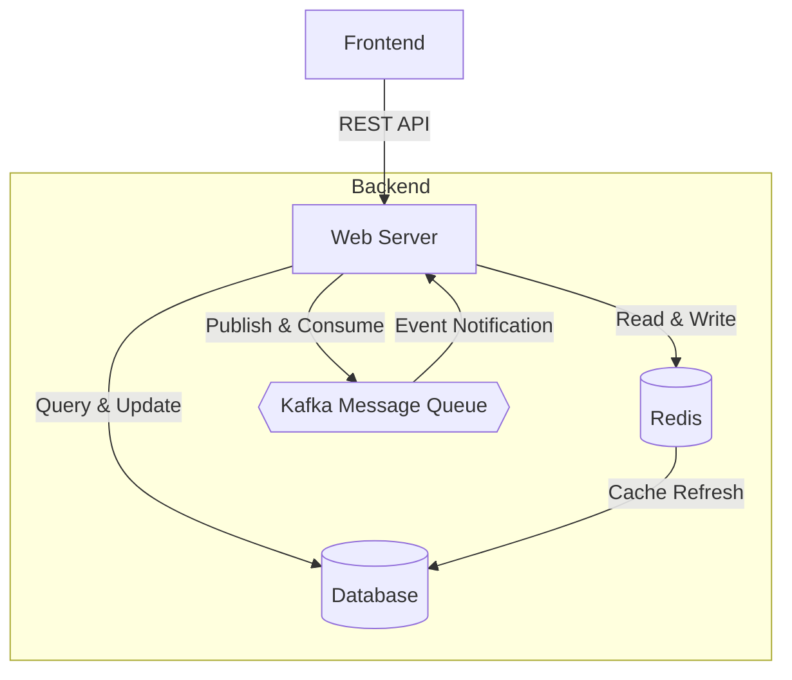
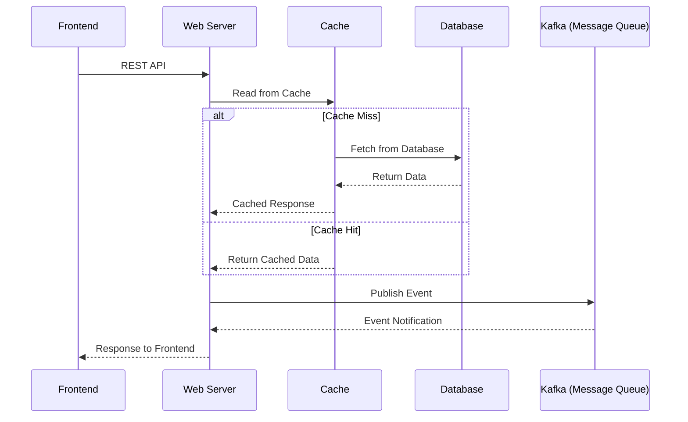
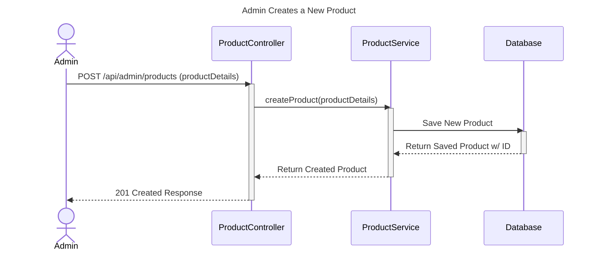
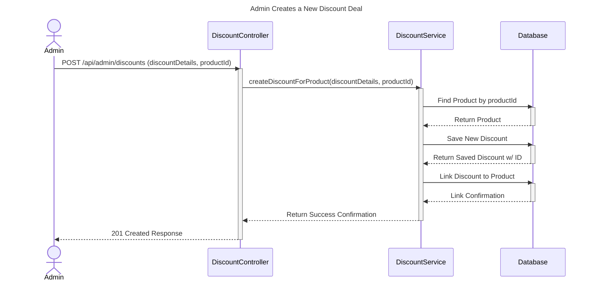
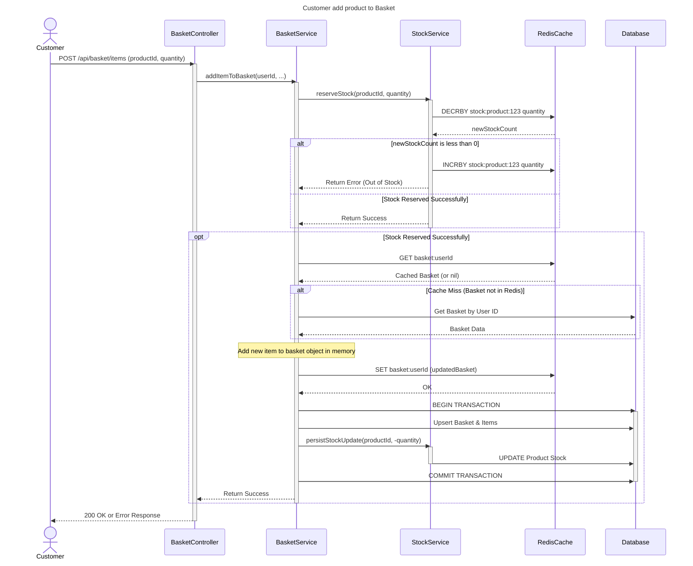
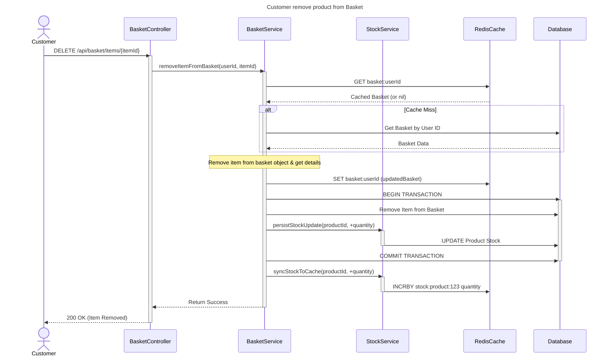
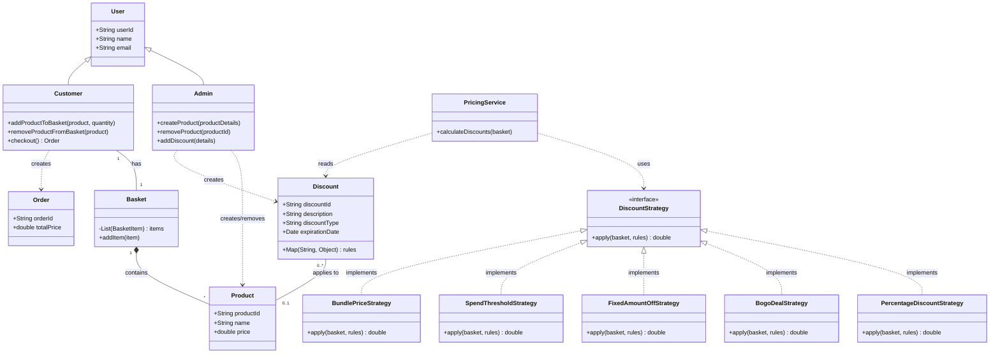
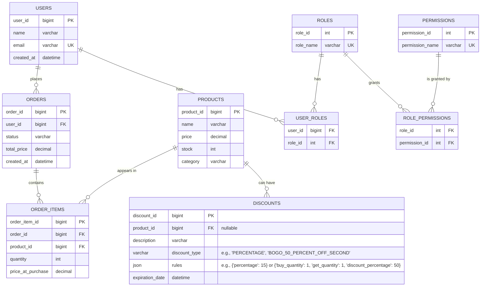

# System Diagrams

This page contains the system diagrams for the Electronic Store Checkout Backend. The diagrams are sourced from the files in the `diagram/` folder.

## High Level Design

**Source:** `diagram/high_level_design.mmd`

## Sequence Diagram

**Source:** `diagram/sequence_diagram.mmd`

## Class Diagram

ER Diagram
