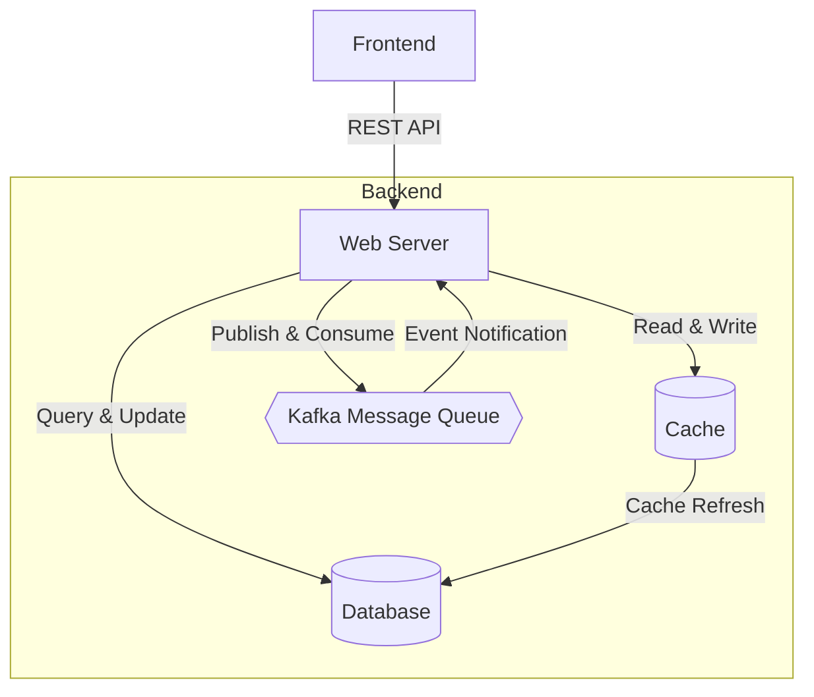
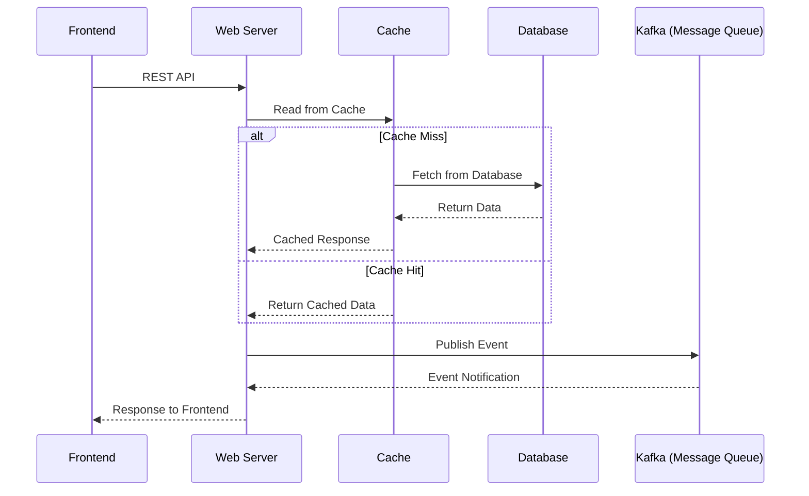
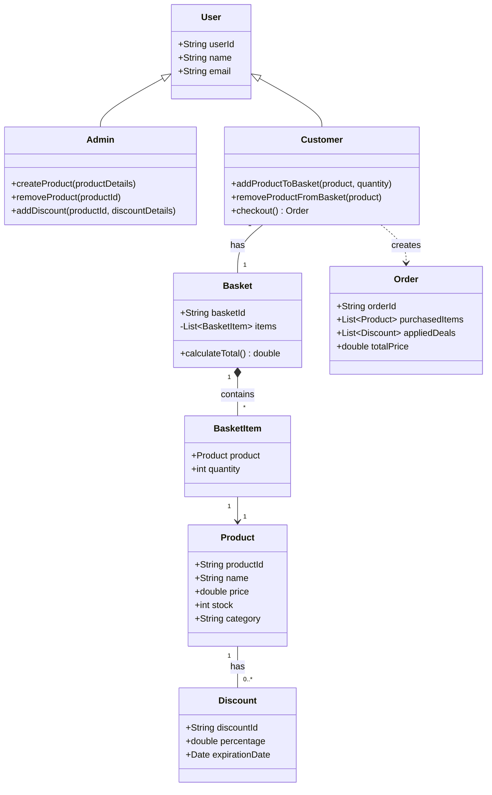

# Electronic Store Checkout Backend

A Spring Boot backend application for electronic store checkout functionality.

## Features

- RESTful API for product management
- JPA/Hibernate for data persistence
- H2 in-memory database for development
- Lombok for reducing boilerplate code
- Maven build system

## Technology Stack

- Java 21
- Spring Boot 3.5.3
- Spring Data JPA
- H2 Database
- Lombok
- Maven

## Project Structure

```
src/
├── main/
│   ├── java/io/github/kkngai/estorecheckout/
│   │   ├── EstorecheckoutApplication.java
│   │   ├── controller/
│   │   │   └── ProductController.java
│   │   ├── service/
│   │   │   └── ProductService.java
│   │   ├── repository/
│   │   │   └── ProductRepository.java
│   │   └── model/
│   │       └── Product.java
│   └── resources/
│       └── application.properties
└── test/
    └── java/io/github/kkngai/estorecheckout/
        └── EstorecheckoutApplicationTests.java
```

## Diagrams

This project includes two diagrams located in the `diagram/` folder:

- **High Level Design**: 



- **Sequence Diagram**: 



- **Class Diagram**:



## Getting Started

### Prerequisites

- Java 21 or higher
- Maven 3.6 or higher

### Running the Application

1. Clone the repository
2. Navigate to the project directory
3. Run the application:

```bash
./mvnw spring-boot:run
```

The application will start on `http://localhost:8080`

### API Endpoints

- `GET /api/products` - Get all products
- `GET /api/products/{id}` - Get product by ID
- `POST /api/products` - Create a new product
- `PUT /api/products/{id}` - Update a product
- `DELETE /api/products/{id}` - Delete a product

### H2 Database Console

Access the H2 database console at: `http://localhost:8080/h2-console`

- JDBC URL: `jdbc:h2:mem:testdb`
- Username: `sa`
- Password: `password`

## Building the Application

```bash
./mvnw clean package
```

## Running Tests

```bash
./mvnw test
``` 